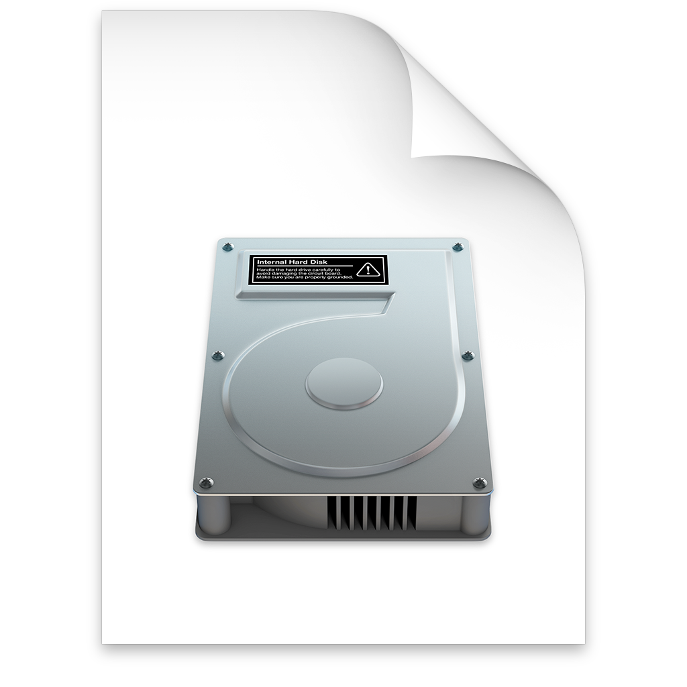

For the most common questions take a look at the [frequently asked question (FAQ)](order-last-faq/faq.html).

---

# Select a device

Select a real iOS device or simulator device in the sidebar before you start to spoof your location.

[How to select a device ⟩](order-1-get-started/topic-1-select-device.html)

---

# The DeveloperDiskImage

The *DeveloperDiskImage* files are required to spoof the location of your iOS device.

[Learn more about the DeveloperDiskImage ⟩](order-1-get-started/topic-2-developerdiskimage.html)

---

# Start spoofing your location

To start spoofing you your location select a point in the map by long clicking on it.

[How to spoof your location ⟩](order-1-get-started/topic-3-spoof-location.html)