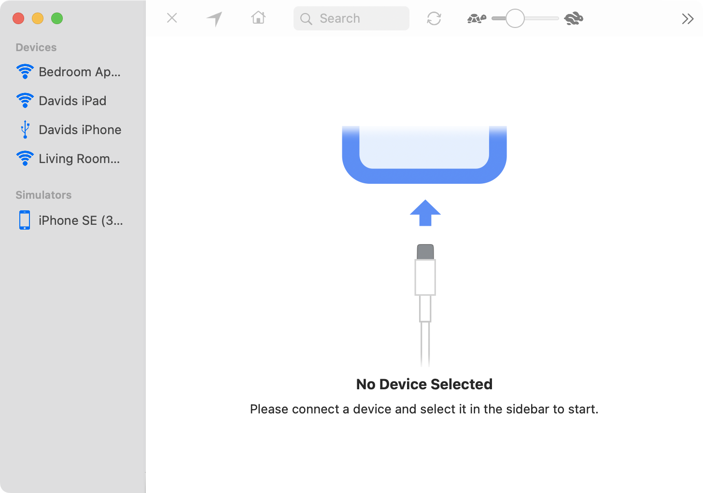

If you open LocationSimulator for the first time you will be greeted by an empty screen, with no device selected. The sidebar on the left side of the window will be expanded and list all your currently connected devices. 

--- 

**The sidebar contains two groups**
<dl>
	<dt>1. Devices:</dt>
	<dd style="margin-bottom: 10px; margin-left: 15px;">This group contains all your connected iOS, watchOS or TvOS devices. These devices can either be connected via USB or Wi-Fi. The icon on the left side of the device name indicates if the device is connected via USB or Wi-Fi. 
	</dd>
	<dt>2. Simulators:</dt>
	<dd style="margin-bottom: 10px; margin-left: 15px;">If you are a developer and use the iPhoneSimulator, than all currently running simulator instances will appear in this group.
	</dd>
</dl> 

--- 

**Select a device in the sidebar**

To select a device in the sidebar, choose either an entry in the *Devices* or the *Simulators* group and click on it. The view on the right hand side will now be replaced with a map view. If you selected a simulator instance, you are ready to go and can [start to spoof the location](topic-3-spoof-location.html). If you instead selected a real iOS device, the [DeveloperDiskImage must first be uploaded to your device](topic-2-developerdiskimage.html). 