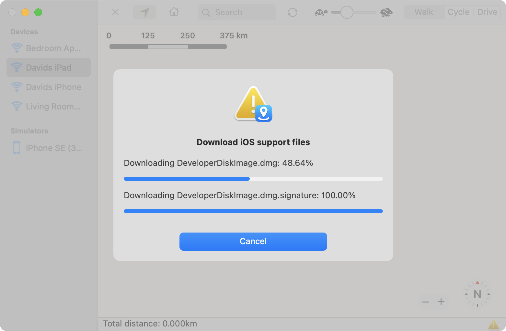
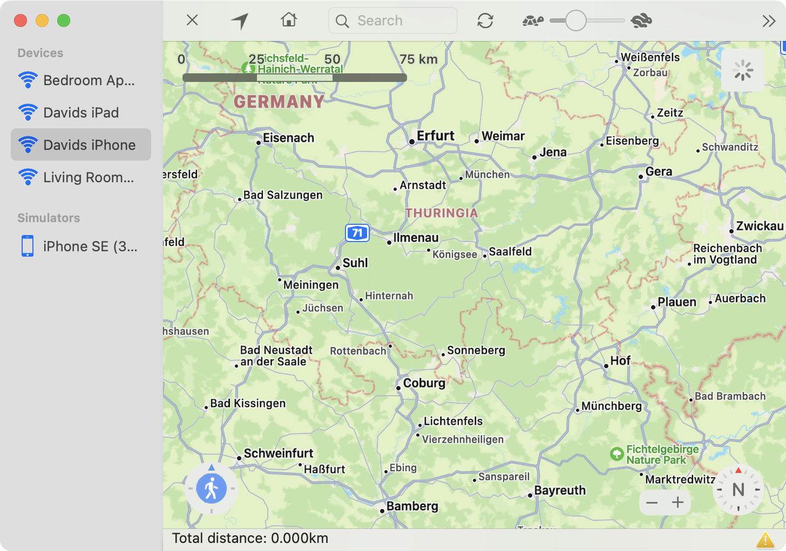
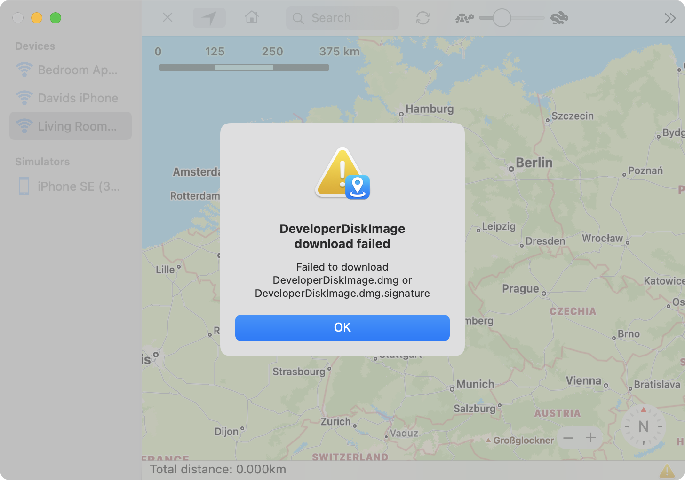

The *DeveloperDiskImage.dmg* and the corresponding *DeveloperDiskImage.dmg.signature* files are required to interact with an iOS device. The first time you connect your iOS device while LocationSimulator is active, an automatic download process is initiated to save these files to your Mac. A new download is only required, if you update your iOS device or if you delete the files. If required, the *DeveloperDiskImage.dmg* files will be uploaded automatically to your iOS device afterwards. Once these files have been uploaded successfully everything will work without uploading them again until you reboot your iOS device.

---

**Uploading the DeveloperDiskImage files**

The upload process will start automatically if you select a device in the sidebar. While the *DeveloperDiskImage* files are uploaded, you can not interact with the displayed map view. The loading indicator in the upper right corner does not stop spinning until the files are uploaded or an error occurs. The yellow warning triangle in the lower right corner will disappear after a successful upload.

---

**Download and upload errors**

If an error occurs either while downloading or uploading the *DeveloperDiskImage* files, you will be presented a descriptive error message. The download can fail if no files are found for your device. Typical reasons for a failed download are:   
1. Your iOS version is to old (older than iOS 10)   
2. Your iOS version is to new (maybe a beta version)    
3. TvOS and watchOS downloads are not supported   
4. The download links are broken   

To fix this problem you can manually search the internet for the required files and store them using the [DeveloperDiskImage preference pane](../order-3-preferences/topic-1-developerdiskimage.html).

An upload error occurs if the *DeveloperDiskImage* files do not match the files required for your device or if the connection to the device is interrupted while the upload is in progress. The first error can occur if you downloaded the wrong files for your device. In the seconds case you might want to reupload the files. To do this click on the yellow warning triangle in the lower right corner of the window.