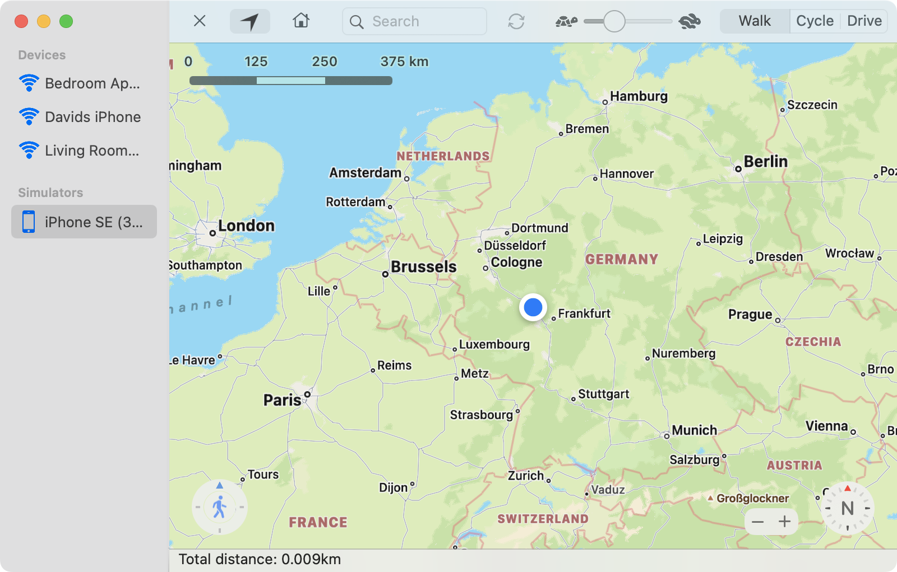
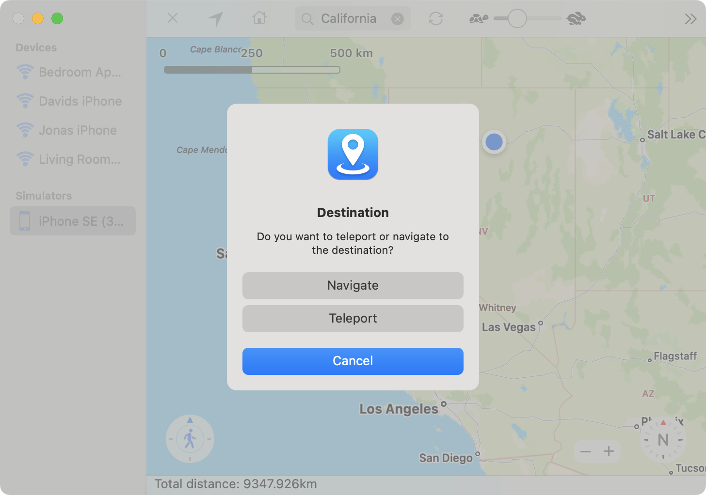

To spoof your device location, a device has to be [selected](topic-1-select-device.html) and the *DeveloperDiskImage* files have to be [uploaded](topic-2-developerdiskimage.html) in case of a real iOS device. You should now see a map view on the right side of the window. To set an initial location, long click somewhere on the map. A blue *current location marker* will appear. The location on you device is now changed to the location you just selected.

---

**Changing the location**

If you long press on a different point inside the map view, while you already set a spoofed location, you will be asked if you want to [navigate](order-2-order-2-spoofing/topic-2-navigate.html) to the new location or teleport. If you choose teleport, your location is changed to the new coordinates.

You can also manually change the location with the movement controls in the lower left corner of the map. The outer ring can be rotated to change the direction you are heading to. To move click on the inner circle, containing the *walking person* icon. You can also use the arrow keys ←, →, ↑, ↓ to move in a direction. If you long press on the *walking person* circle, it will turn blue to indicate that you started the auto movement. Your location will now be updated periodically. You can still change the heading while the location is updated. The ← and → arrow can also be used to change the heading while auto moving is active. This allows you to easily move without manually initiating every location change. If you click again on the *walking person* circle auto movement will stop.

---

**Stop location spoofing**

To stop spoofing your current location select the reset toolbar item or the menu item `Navigation` → `Reset location`. The blue *current location marker* will now disappear and your device will use the real location again.

---

**Errors while changing the location**

Errors while changing the location do sometimes occur when the connection to the device fails. Try rebooting your iOS device and see if this solves the problem.
