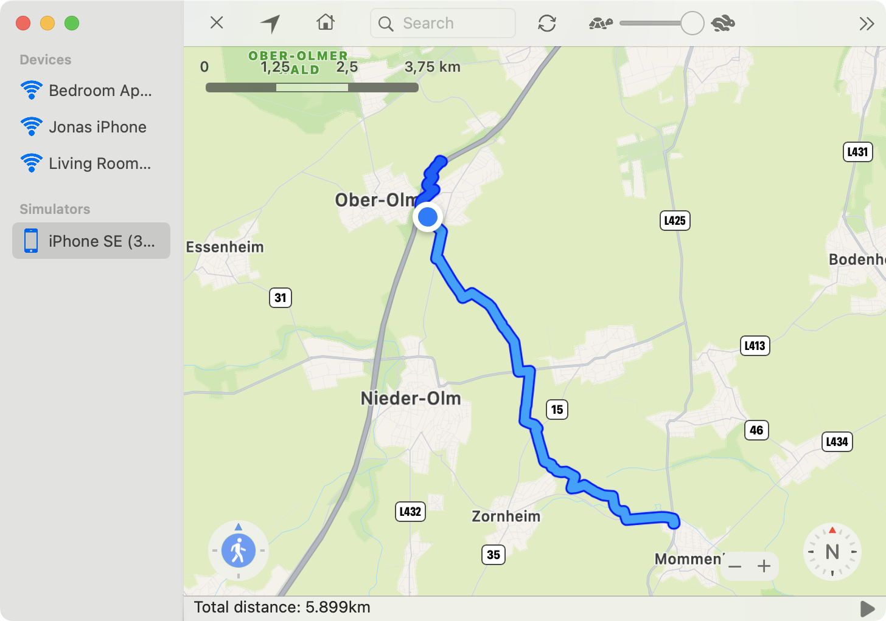

If you select a new coordinate, while you already set a current location you will be asked if you want to navigate to the new location. If you choose this option, the route to the destination coordinates will be calculated and the location is automatically updated to follow the route. The dark blue path indicates the way you already traveled along. The light blue path is the upcoming route.

--- 

**Pause a navigation**   
 
To pause an existing navigation choose `Navigation` → `Toggle Automove` or press the `Space` key. The play / pause item in the lower right corner of the window will update accordingly to represent the current status.

--- 

**Stop a navigation**    

To stop a navigation without resetting the location you can select `Navigation` → `Stop Navigation` or click on the highlighted *walking person* circle. 