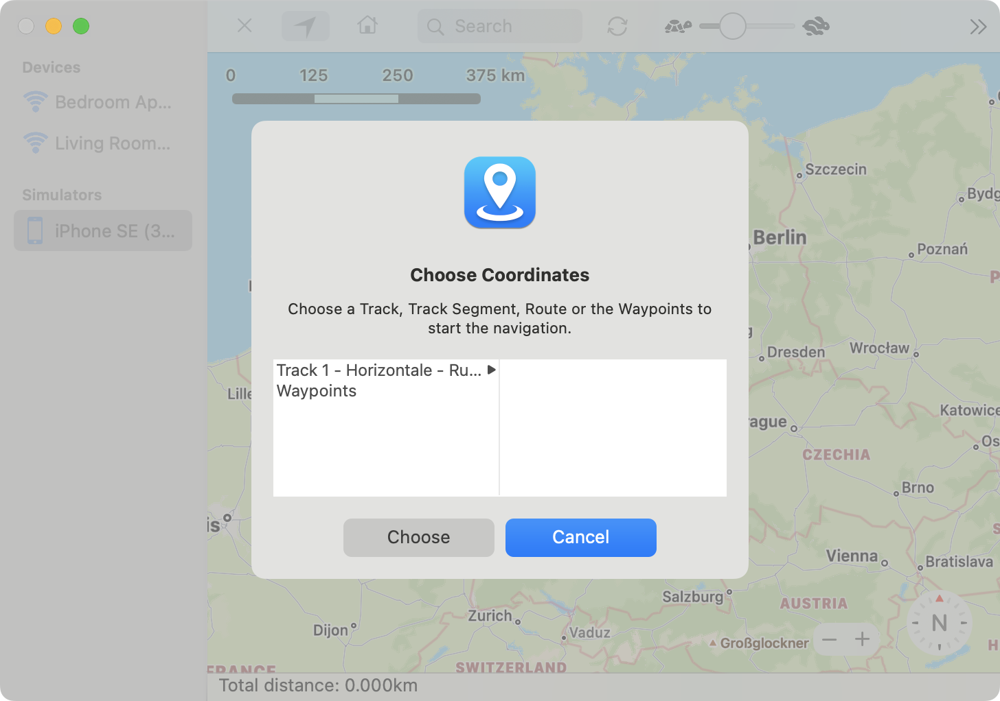

LocationSimulator can start a navigation based on a GPX file. To open an existing GPX file choose `File` → `Open GPX file…`. A popup will appear which allows you to select the file. If the file contains more than one route information, you can select the desired one.

---

**Start the navigation**     

After selecting the desired GPX route you will be asked if you want to teleport or navigate to the start of the destination coordinates if you already set a current location. If you choose the navigation option a route to the start of your selected GPX route is calculated and appended to the navigation. If you choose teleport your current location is set the first coordinates defined in your selection and a navigation according to the defined route is started.