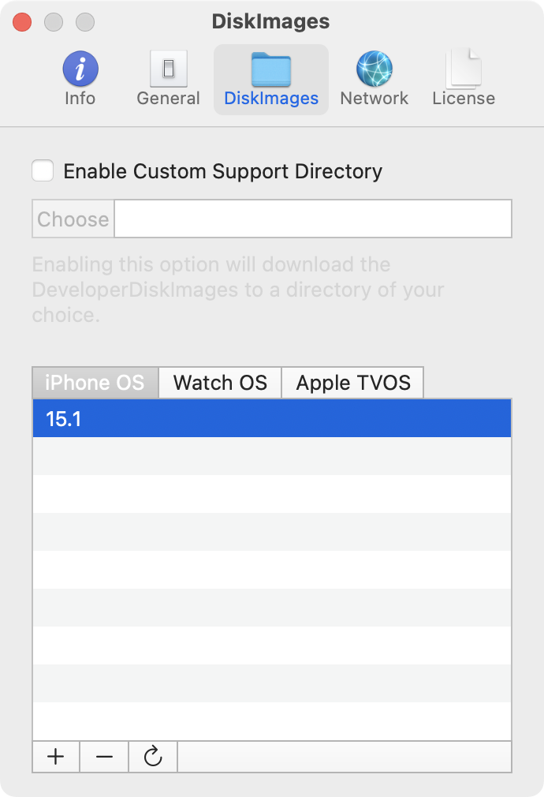
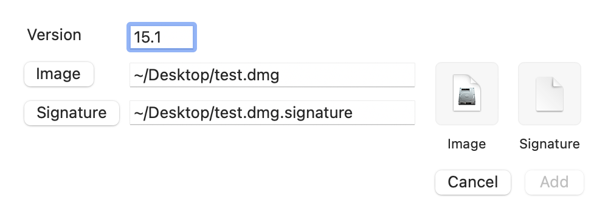

In the *DiskImages* preferences pane you can manage all downloaded *DeveloperDiskImage* files. You can enable a custom support directory to change the folder the *DeveloperDiskImage* files are saved to.
The window contains a tab for each supported platform. Selecting a platform will update the list below it with all version numbers for which the *DeveloperDiskImage* files exist.

--- 

**Add DeveloperDiskImage files**   
 
To add *DeveloperDiskImage* files for a specific platform, select it and click on the `+` button. A dialog will appear, which allows you to specify the version number for which you want to add the files. The version number should always have the format `major.minor`. No revision number should be included. That means for example: 15.1 is valid, while 15.1.2 is invalid. Use the `Image` button to select a *DeveloperDiskImage.dmg* and the `Signature` button to select a *DeveloperDiskImage.dmg.signature* file from your mac. You can also drag and drop the files to the boxes on the right side. Confirm your action by clicking the `Add` button. A new entry in the list with the specified version number should appear. A matching device will automatically upload the files the next time it is selected in the sidebar.
 

--- 

**Remove DeveloperDiskImage files**   

To remove the *DeveloperDiskImage* files for a specific version and platform, select an entry in the list and click on the `-` button. The entry will disappear. The files will be redownloaded if required and necessary.

---

**Refresh DeveloperDiskImage files**  

To refresh existing *DeveloperDiskImage* files, select an entry in the list and click the `⟳` button. The files will be redownloaded if possible. This is useful if you downloaded or added files for a beta version, since it might need an update if the final version or a newer beta version is released. This might also be necessary if the *DeveloperDiskImage* files somehow got corrupted.