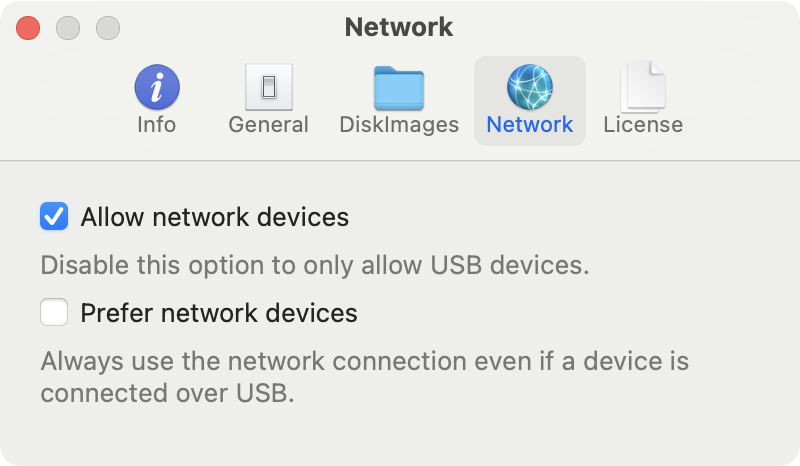

In the *Network* preferences pane you can manage all settings related to devices detected via Wi-Fi.

--- 

**Detect devices in your network**   

To detect and use devices connected to your Wi-Fi network your device must be accessible inside *Finder* over the network. Take a look at [this apple support page](https://support.apple.com/en-gb/guide/mac-help/mchlada1d602/mac) for detailed instructions of how to setup the Wi-Fi access. If you made sure that you can access and synchronize your device inside *Finder* over the network, turn on the `Allow network devices` option. If the option is already active, toggle it off and turn it on again.